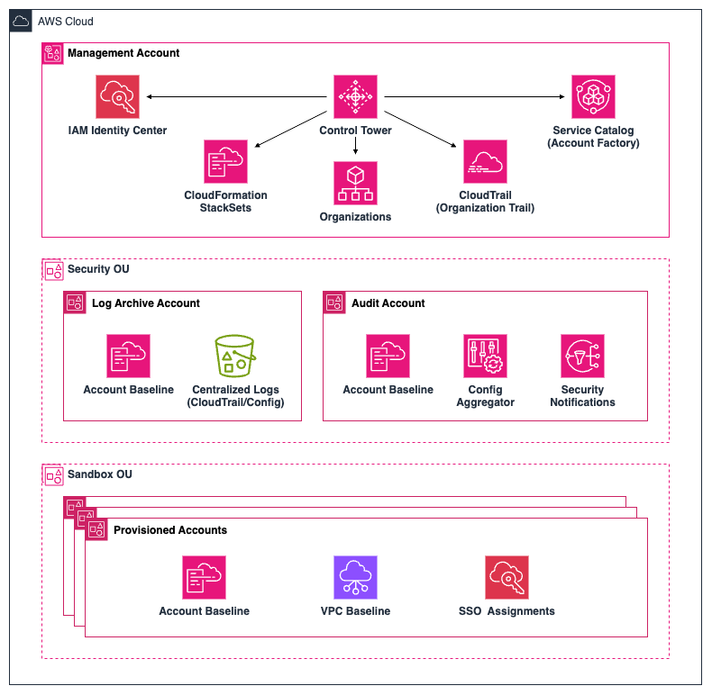
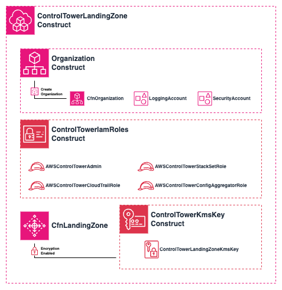

# AWS CDK Control Tower Landing Zone

This project demonstrates how to configure and deploy an [AWS Control Tower](https://aws.amazon.com/controltower/) landing zone using the [AWS Cloud Development Kit](https://github.com/aws/aws-cdk/) (CDK) with TypeScript.
Control Tower is a straightforward way to set up and govern an AWS multi-account environment, following prescriptive best practices.
It serves as an orchestration layer that facilitates deployment, management and governance of your AWS accounts.  

This app leverages the CDK to simplify configuration and deployment of a landing zone, using Infrastructure as Code (IaC). 
Use it as is, as part of [establishing your initial cloud foundation on AWS](https://aws.amazon.com/solutions/guidance/establishing-an-initial-foundation-using-control-tower-on-aws/), or as a reference for building your own custom solution.

  
_Basic components of a Control Tower landing zone. For more info, see [How AWS Control Tower Works](https://docs.aws.amazon.com/controltower/latest/userguide/how-control-tower-works.html)_.

## Project Overview
The CDK app implements an AWS Control Tower landing zone, including pre-requisite foundational accounts and resources, via a single `ControlTowerLandingZone` construct in the `ControlTowerLandingZoneStack` CloudFormation stack.

  
_Overview of the ControlTowerLandingZone construct._

The `ControlTowerLandingZone` construct is a layer 3 (L3) construct that creates all the necessary resources for a Control Tower landing zone deployment. It consists of several other constructs that handle service specific resource creation for the Control Tower landing zone and it's pre-requisites.

The `Organization` construct handles the necessary AWS Organizations resources, including the organization itself, and two foundational shared accounts for the Control Tower landing zone.

The `ControlTowerIamRoles` construct creates four IAM service roles required for Control Tower to access and manage the associated infrastructure.

If encryption is enabled, a KMS customer managed key is created via the `ControlTowerKmsKey` construct. This key is used for data encryption with Control Tower enabled services (AWS CloudTrail, AWS Config) and the associated AWS S3 data.

The resulting AWS Control Tower landing zone will include the following:
- 2 organizational units, one for your shared accounts and one for accounts that will be provisioned by your users.
- 3 shared accounts, which are the management account and isolated accounts for log archive and security audit.
- A CloudTrail Organization trail.
- An Account Factory service leveraging Service Catalogue.
- An IAM Identity Center organization instance.
- 20 preventive controls to enforce policies and 3 detective controls to detect configuration violations.


## Prerequisites
You will need programmatic access to the management account of your organization, using credentials with administrator access permissions to deploy the CDK app. 
If creating a new environment from scratch, it is recommended to enable IAM Identity Center with AWS Organizations and then grant access to a user for this. Control Tower will assume control (pun intended) of the existing organization and IAM Identity Center instance. 
For detailed instruction, see [AWS Control Tower - Setting Up](https://docs.aws.amazon.com/controltower/latest/userguide/setting-up.html).

## Working with Projen

This project relies on [Projen](https://github.com/projen/projen) for synthesized project configuration and management.
#### Useful Projen Commands

* `npx projen build`   Full release build - compile, synth, test, lint
* `npx projen watch`   Watches changes in your source code and rebuilds and deploys to the current account
* `npx projen test`    Perform the jest unit tests independently
* `npx projen deploy`  Deploys your CDK app to the AWS cloud
* `npx projen destroy`  Destroys your CDK app in the AWS cloud
* `npx projen diff`    Diffs the currently deployed app against your code
* `npx projen synth`   Synthesizes your cdk app into cdk.out
* `npx projen upgrade` Upgrade project dependencies

## Getting Started

1. Clone this repository:
```bash
git clone https://github.com/ScottNoPantsOn/aws-control-tower-lz-cdk.git
cd aws-control-tower-lz-cdk
```

2. Install dependencies:
```bash
npx projen install
```

3. Update the `ControlTowerLandingZone` construct props in `aws-cdk-control-tower-lz-example-stack.ts` to suit your desired configuration.


Example configuration:
```typescript
new ControlTowerLandingZone(this, 'ControlTowerLandingZone', {
  governedRegions: [ 'YOUR-HOME-REGION','us-east-1'],
  landingZoneVersion: '3.3',
  loggingBucketRetentionPeriod: '365',
  accessLoggingBucketRetentionPeriod: '3600',
  encryption: true,
  securityAccountEmail: 'security@example.email',
  loggingAccountEmail: 'logging@example.email',
});
``` 
Refer to the `IControlTowerLandingZoneProps` interface to view all available props.

4. Compile any changes, then synthesize the CloudFormation template with the Projen `build` task:
```bash
npx projen build
```

5. Bootstrap the account if you haven't already:
```bash
npx cdk bootstrap
```

6. Deploy the stack using Projen:
```bash
npx projen deploy
```

During deployment, the root management account email will receive an IAM Identity Center invitation email for the AWS Control Tower Admin user.
The security account email will then receive an SNS subscription confirmation request email for each governed region in your landing zone configuration.

## Testing

Some unit tests have been defined for each of the custom constructs using the CDK [Assertions](https://docs.aws.amazon.com/cdk/api/v2/docs/aws-cdk-lib.assertions-readme.html) module.  
Tests are run as part of the Projen `build` task, but you can run tests independently if needed:
```bash
npx projen test
```
For more information on testing CDK applications, see [Test AWS CDK applications](https://docs.aws.amazon.com/cdk/v2/guide/testing.html).

## Additional Resources

- [Designing an AWS Control Tower Landing Zone](https://docs.aws.amazon.com/prescriptive-guidance/latest/designing-control-tower-landing-zone/introduction.html)
- [Document Your AWS Landing Zone Design](https://docs.aws.amazon.com/prescriptive-guidance/latest/patterns/document-your-aws-landing-zone-design.html)
- [AWS Control Tower Documentation](https://docs.aws.amazon.com/controltower/)
- [AWS CDK Documentation](https://docs.aws.amazon.com/cdk/)
- [AWS IAM Best Practices](https://docs.aws.amazon.com/IAM/latest/UserGuide/best-practices.html)
